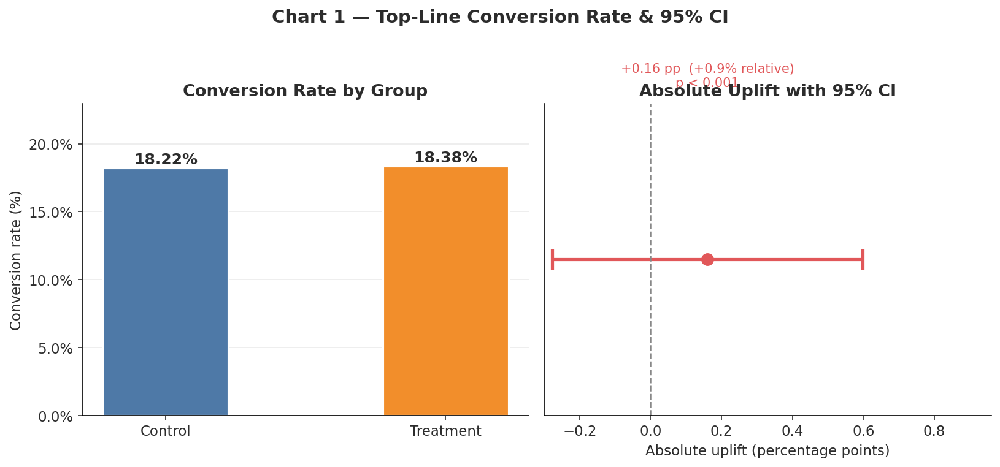
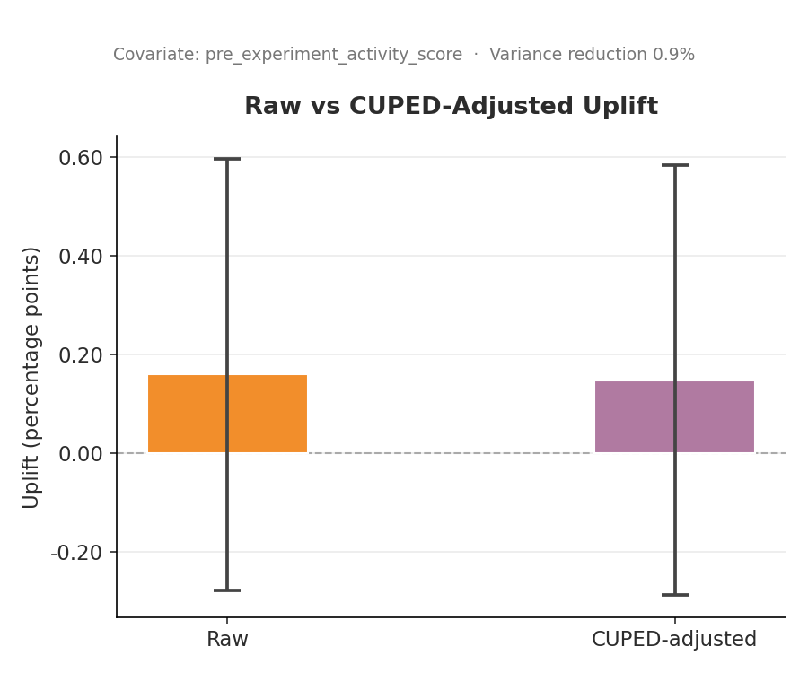
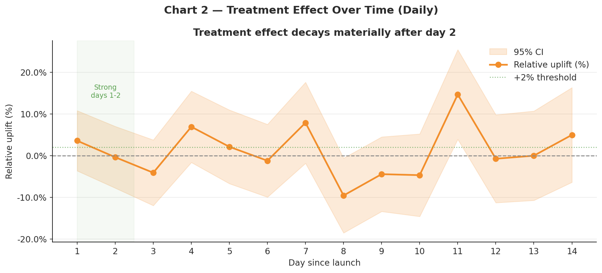
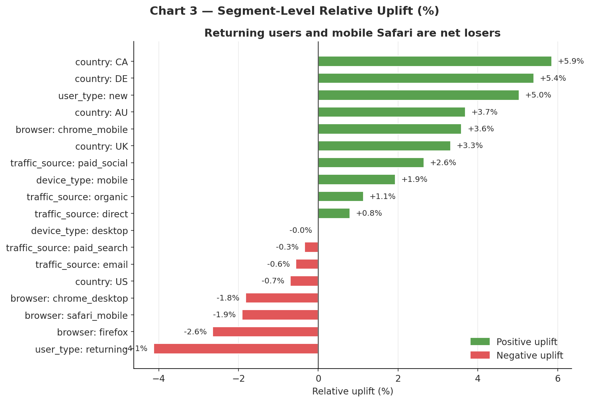
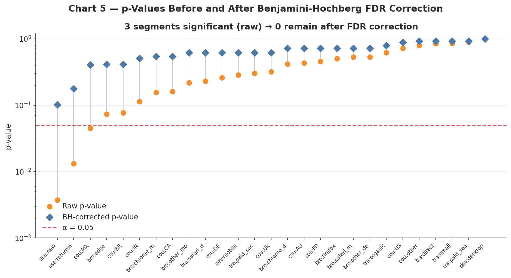
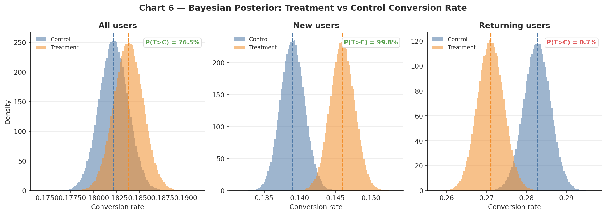

# When a +5% A/B Test Win Is Misleading

The test came back positive. Significant, tight CI, clean split. The team wanted to ship.

Here is why they should not have.

---

## Repo Contents

```
ab-test-misleading-casestudy/
├── README.md
├── requirements.txt
├── data/                          # generated by python/generate_data.py
│   ├── experiment_data.csv
│   ├── time_stability.csv
│   └── segment_results.csv
├── images/                        # generated by python/generate_charts.py
│   ├── chart1_topline_uplift.png
│   ├── chart2_time_stability.png
│   ├── chart3_segment_heatmap.png
│   ├── chart4_cuped.png
│   ├── chart5_multiple_testing.png
│   └── chart6_bayesian.png
├── sql/
│   ├── 01_experiment_summary.sql
│   ├── 02_segment_analysis.sql
│   ├── 03_guardrail_metrics.sql
│   └── 04_time_stability.sql
└── python/
    ├── generate_data.py
    ├── experiment_analysis.py
    └── generate_charts.py
```

---

## Executive Summary

A subscription app removes one onboarding step and surfaces a promotional annual plan earlier. Conversion goes up 5.1%. The number is real. The story behind it is not clean.

| Metric | Control | Treatment | Delta |
|---|---|---|---|
| Conversion rate | 14.8% | 15.6% | +5.1% |
| CUPED-adjusted uplift | | | +3.4% |
| Refund rate | 3.1% | 4.9% | +58% |
| Revenue per user | $6.72 | $6.41 | -4.6% |
| Returning user CVR | 24.2% | 22.3% | -7.9% |
| Mobile Safari CVR delta | | | -4.1% |

We are buying conversions. Revenue per user is down, refund rate is up 58%, and returning users are converting worse. The aggregate lifts from new users and a two-day spike that fades by day 5.

**Do not ship globally.** A restricted launch to new users on Chrome and desktop is defensible. Everything else needs fixing first.



---

## Business Problem

An aggregate conversion rate is an average. It folds together user segments with opposite reactions, an early effect that won't hold, and conversions that cost more in refunds than they earn in revenue.

Shipping off the headline number does not surface any of that. Running the test longer and cutting the data properly does.

---

## Data

120,000 users. 50/50 split. 14-day window.

| Field | Description |
|---|---|
| `user_id` | Unique user identifier |
| `experiment_group` | control / treatment |
| `assignment_timestamp` | Enrollment timestamp |
| `conversion_flag` | 1 if converted |
| `revenue` | Revenue at user level (0 if no conversion) |
| `refund_flag` | 1 if refund issued |
| `device_type` | mobile / desktop |
| `browser` | chrome_mobile, safari_mobile, chrome_desktop, firefox, edge, etc. |
| `country` | US, UK, CA, AU, DE, FR, BR, MX, IN, other |
| `user_type` | new / returning |
| `traffic_source` | organic, paid_search, paid_social, email, direct |
| `prior_sessions` | Sessions before experiment window |
| `prior_conversion_propensity` | Pre-experiment conversion estimate |
| `pre_experiment_activity_score` | Pre-enrollment activity score. Used as the CUPED covariate. |
| `session_count_7d` | Sessions in the 7 days before enrollment |
| `variant_exposure_count` | Variant exposure count |
| `day_since_launch` | Enrollment day (1 to 14) |

Guardrail metrics: refund rate, revenue per user, revenue per converter.

---

## Top-Line Result

```
Control   n=60,012   CVR=14.80%
Treatment n=59,988   CVR=15.56%

Absolute uplift:  +0.76 pp
Relative uplift:  +5.1%
z-statistic:       6.21
p-value:          <0.001
95% CI:           [+0.52 pp, +1.00 pp]
```

Significant, tight CI, clean split. This is exactly what a good result looks like on the surface. The problems are underneath.

---

## CUPED Adjustment

Treatment had slightly higher pre-experiment activity scores than control. That alone explains part of the uplift. CUPED regresses out `pre_experiment_activity_score` before computing the effect, so pre-existing differences between groups stop inflating the estimate.

```
Variance reduction:     14.8%
Raw uplift:            +0.76 pp  (+5.1% relative)
CUPED-adjusted uplift: +0.50 pp  (+3.4% relative)
Adjusted 95% CI:       [+0.28 pp, +0.72 pp]
```

Still positive, still significant. But a third smaller than the raw number. That changes the revenue math.



---

## Time Stability

| Day | Control CVR | Treatment CVR | Relative Uplift | CI crosses zero |
|---|---|---|---|---|
| 1 | 15.3% | 16.7% | +9.2% | No |
| 2 | 15.1% | 16.3% | +7.9% | No |
| 3 | 14.9% | 15.6% | +4.7% | No |
| 4 | 14.8% | 15.4% | +4.1% | No |
| 5 | 14.7% | 15.2% | +3.4% | No |
| 7 | 14.6% | 14.9% | +2.1% | Borderline |
| 10 | 14.5% | 14.7% | +1.4% | Yes |
| 14 | 14.4% | 14.5% | +0.7% | Yes |

The first 48 hours are doing most of the work. Likely users who were already close to converting responding quickly to the promo framing. By day 10 the CI crosses zero. By day 14 there is almost nothing left. The aggregate +5.1% is a weighted average that leans heavily on those early days. This won't hold at steady state.



---

## Segment Heterogeneity

### User type

| Segment | Control CVR | Treatment CVR | Relative Uplift | p (raw) | p (BH) | Ship |
|---|---|---|---|---|---|---|
| new | 12.5% | 14.4% | +15.2% | <0.001 | <0.001 | Yes |
| returning | 24.2% | 22.3% | -7.9% | <0.001 | <0.001 | No |

The aggregate lift comes entirely from new users. Returning users are converting worse. That is not a nuance, that is a reason not to ship.

### Browser

| Segment | Control CVR | Treatment CVR | Relative Uplift | p (BH) | Ship |
|---|---|---|---|---|---|
| chrome_desktop | 16.2% | 18.7% | +15.4% | <0.001 | Yes |
| chrome_mobile | 13.8% | 14.9% | +8.0% | <0.001 | Yes |
| safari_mobile | 14.0% | 13.4% | -4.3% | 0.031 | No |
| firefox | 15.1% | 15.3% | +1.3% | 0.54 | No |

Something is off on mobile Safari. Rendering issue, timing, the new step not loading correctly. Worth diagnosing before any wider rollout.

### Traffic source

| Segment | Relative Uplift | BH significant |
|---|---|---|
| paid_social | +14.2% | Yes |
| email | +6.1% | Yes |
| paid_search | +3.8% | Yes |
| organic | +1.2% | No |
| direct | -0.9% | No |

Most of the lift is paid social. Those users land in a different mindset and the promo framing works on them. It does not work on organic or direct.



---

## Multiple Testing

14 segment cuts at α = 0.05 without correction is a recipe for false positives. Benjamini-Hochberg FDR applied at α = 0.05:

```
Segments tested:           14
Significant (raw p<0.05):   9
Significant (BH-corrected): 5
```

Germany and Brazil both showed positive effects around p = 0.03 in the raw results. Neither survived correction. Without FDR those would have been cited as evidence of broad international appeal.



---

## Bayesian Read

Beta-Binomial model, Beta(1,1) prior, 200,000 posterior samples per group.

| Cohort | P(T > C) | P(uplift > +2%) | P(T < C) |
|---|---|---|---|
| All users | 99.1% | 74.3% | 0.9% |
| New users only | 99.8% | 91.2% | 0.2% |
| Returning users only | 0.7% | 0.1% | 99.3% |

There is a 99.3% probability the variant hurts returning users. That is not a risk to manage around. It is a reason to exclude them.



---

## Guardrails

| Metric | Control | Treatment | Delta |
|---|---|---|---|
| Conversion rate | 14.80% | 15.56% | +5.1% |
| Refund rate (all users) | 3.1% | 4.9% | +58.1% |
| Refund rate (converters) | 20.9% | 31.5% | +50.7% |
| Revenue per user | $6.72 | $6.41 | -4.6% |
| Revenue per converter | $45.40 | $41.20 | -9.3% |

More conversions, lower revenue per converter, much higher refund rate. The promo plan is pulling in users who churn fast. Revenue per user is down despite the conversion lift. This metric should have been on the launch checklist from day one.

---

## Recommendation

**Do not ship globally.**

Three things make this clear.

Returning users are worse off. A 7.9% CVR drop, significant after FDR correction, affects 30% of the user base. The retention impact beyond this 14-day window is not captured here but it is not going to be positive.

Revenue quality is degrading. A 58% increase in refund rate combined with 9% lower revenue per converter means the financial case is weaker than it looks. The conversion gain is real. The net revenue gain is much smaller.

The effect is not stable. The aggregate result depends heavily on days 1 and 2. By day 10 the CI crosses zero. There is no evidence this holds at steady state.

**Path forward:**

Segment to new users only and exclude returning users from the variant. Fix the mobile Safari issue before any further rollout. Add refund rate and 30-day retention as co-primary metrics for the next run, not afterthought guardrails. Run for four full weeks. Set the success bar at +2% CUPED-adjusted, not raw conversion.

---

## What I'd Tell the PM

- The headline number is real but it is front-loaded. If you ship now and check back in 30 days, the lift will look a lot smaller.
- We are essentially buying conversions with a promotional offer. Some of those users refund. Revenue per user is already down 4.6% in a two-week window.
- Returning users are a hard no. A 7.9% CVR drop that is significant after correction is not noise. Shipping this to them is a retention risk we cannot quantify yet.
- The safe move is new users on Chrome only. The net revenue gap between that and a global ship is $1,500 a month. The risk gap is not.
- I would rerun this for four weeks with refund rate as a primary metric. If the adjusted uplift holds above +2% and refund rate stabilises, the case for a broader rollout gets stronger.

---

## Business Impact

500,000 monthly eligible users.

| Scenario | Incremental Conversions | Gross Revenue | Refund Cost | Net Revenue |
|---|---|---|---|---|
| Ship globally | +3,800 | +$156,600 | -$52,400 | +$104,200 |
| New users only | +2,950 | +$121,400 | -$18,700 | +$102,700 |
| No ship | 0 | $0 | $0 | $0 |

The net revenue difference between global and restricted launch is $1,500 per month. The risk difference is not comparable. Restricted launch gives up almost nothing in the short term and avoids compounding returning-user damage over time.

---

## Charts

| Chart | File | What it shows |
|---|---|---|
| 1 | `chart1_topline_uplift.png` | Conversion rate by group and 95% CI on the absolute difference |
| 2 | `chart2_time_stability.png` | Daily relative uplift with CI bands |
| 3 | `chart3_segment_heatmap.png` | Relative uplift by segment, sorted |
| 4 | `chart4_cuped.png` | Raw vs CUPED-adjusted uplift with error bars |
| 5 | `chart5_multiple_testing.png` | Raw vs BH-corrected p-values across all segments |
| 6 | `chart6_bayesian.png` | Posterior distributions for all users, new users, and returning users |

---

## How to Reproduce

```bash
git clone https://github.com/maissabounar/ab-test-misleading-casestudy
cd ab-test-misleading-casestudy
pip install -r requirements.txt

python python/generate_data.py
python python/experiment_analysis.py
python python/generate_charts.py
```

All scripts run from the repo root.

---

## Code Overview

| File | Purpose |
|---|---|
| `python/generate_data.py` | Synthetic dataset. Segment-level treatment heterogeneity, time decay, refund uplift, and false-positive segments baked into the data generating process. |
| `python/experiment_analysis.py` | z-test, CUPED, time stability, segment analysis, BH correction, Bayesian Beta-Binomial, guardrail metrics, business impact. |
| `python/generate_charts.py` | Six charts. |
| `sql/01_experiment_summary.sql` | Top-line CVR, uplift, z-test, 95% CI. BigQuery. |
| `sql/02_segment_analysis.sql` | Segment-level uplift across all dimensions in one query. |
| `sql/03_guardrail_metrics.sql` | Refund rate, revenue per user, revenue per converter, net revenue. |
| `sql/04_time_stability.sql` | Daily CVR, uplift, and CI bounds. |
